# Testing Result for e-commerce App

## Unit Testing

Tested using go test

| No| Name | Result |
| --| ------|-------------|
| 1 | Repository Units | 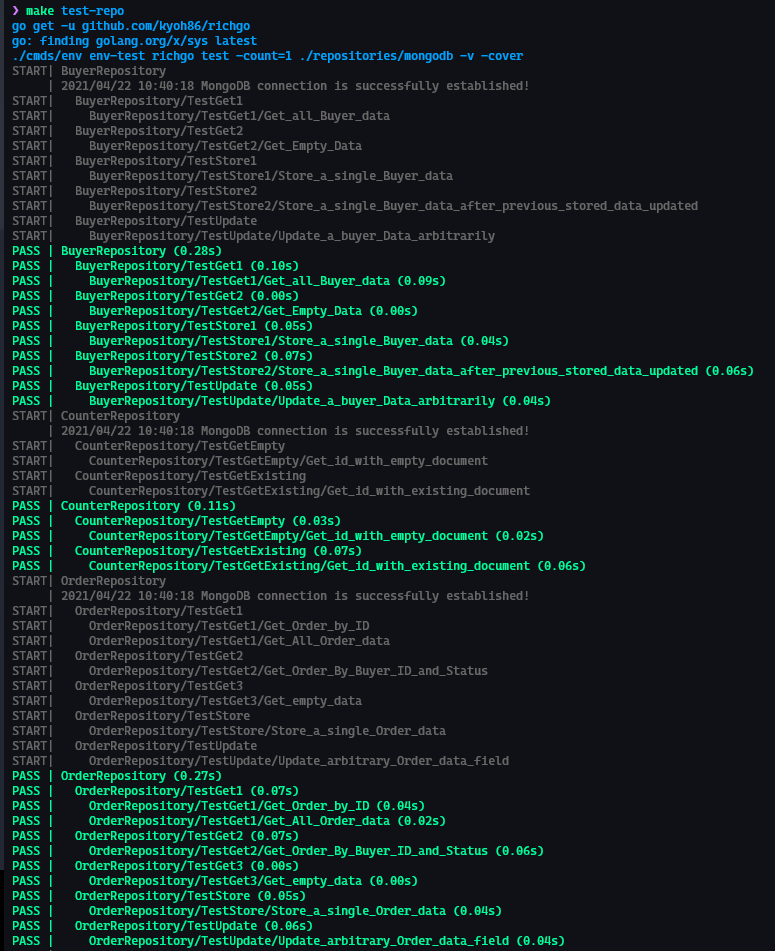   |
| 2 | Repository Units extended | 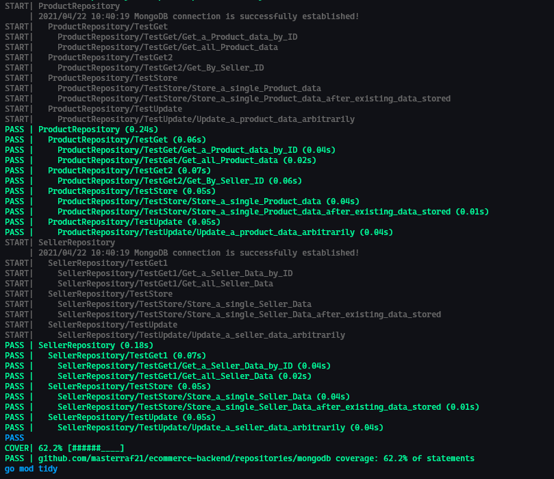   |
| 3 | Usecase Units      |  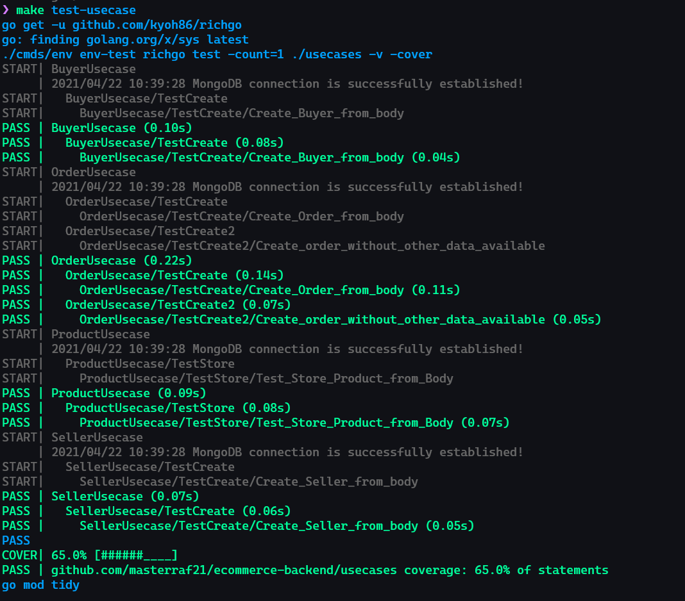   |

## Integrated testing
 
 Tested using Postman

 | No | API |  Name | Result |
| --| ------|-------|-------------|
| 1 | Buyer | Get All Buyer | 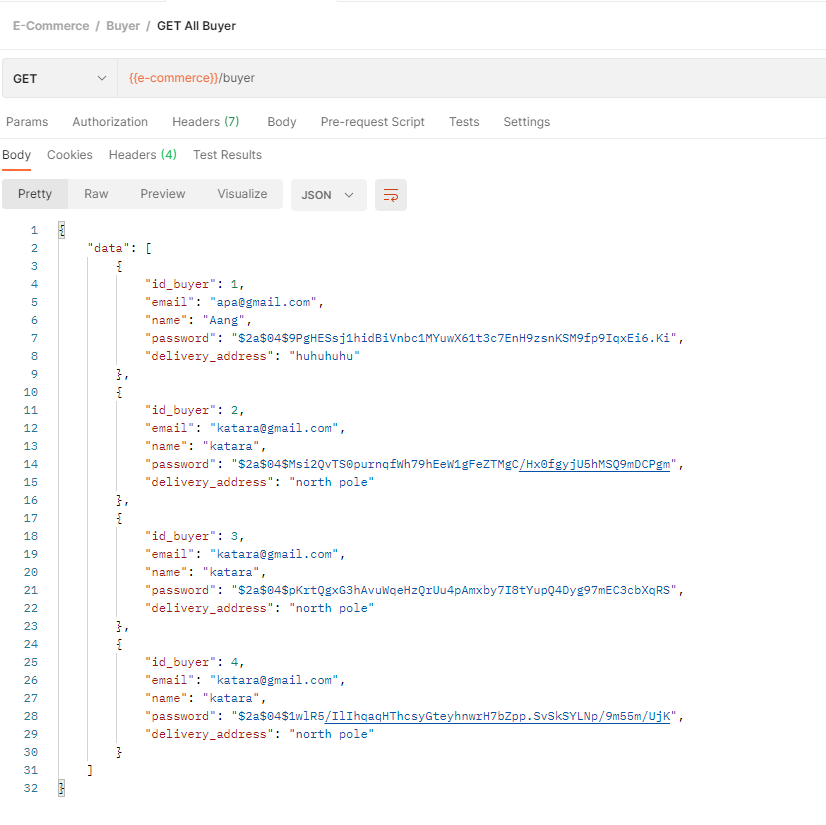   |
| 2 | Buyer | Get Buyer by ID | 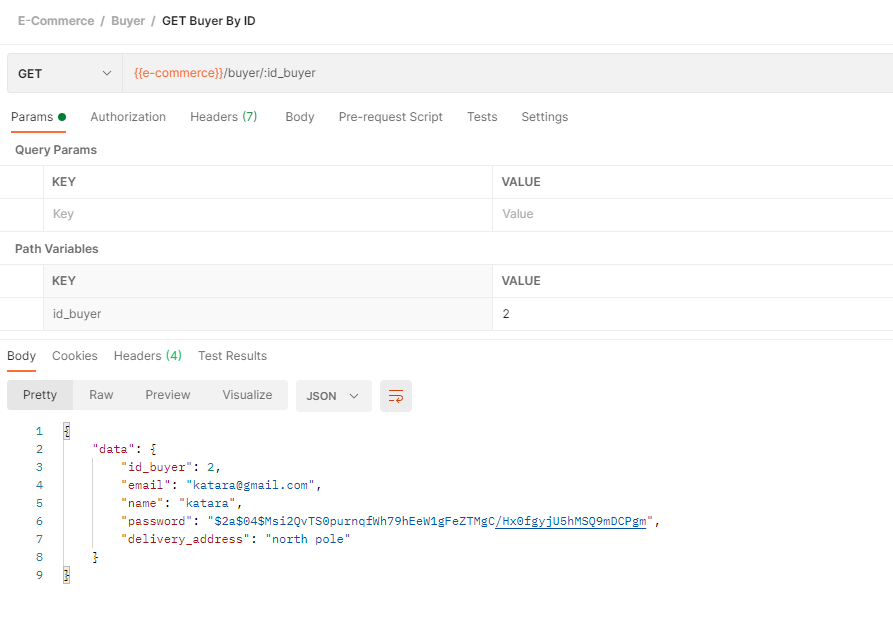   |
| 3 | Buyer | Create  Buyer | 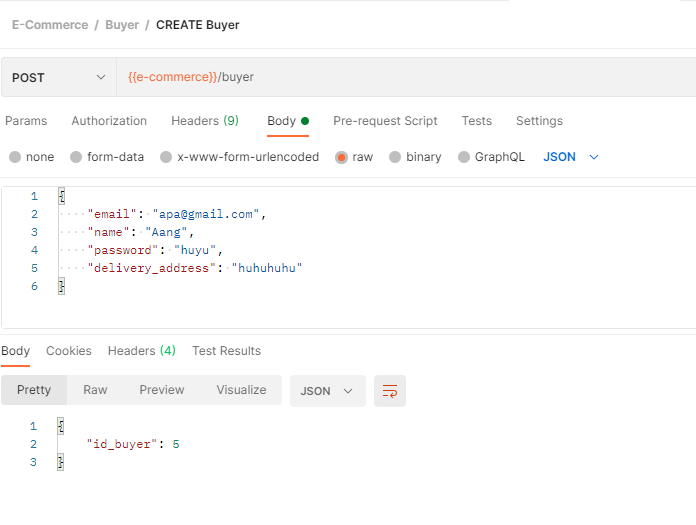   |
| 4 | Seller | Get All  Seller | 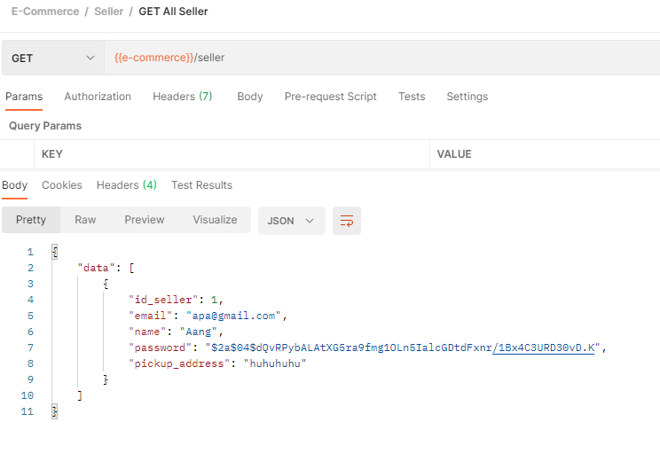   |
| 5 | Seller | Get Seller by ID | 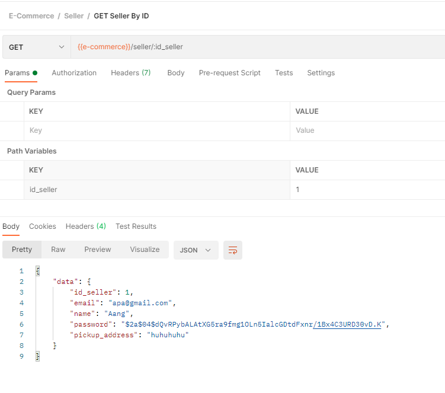   |
| 6 | Seller | Create seller | 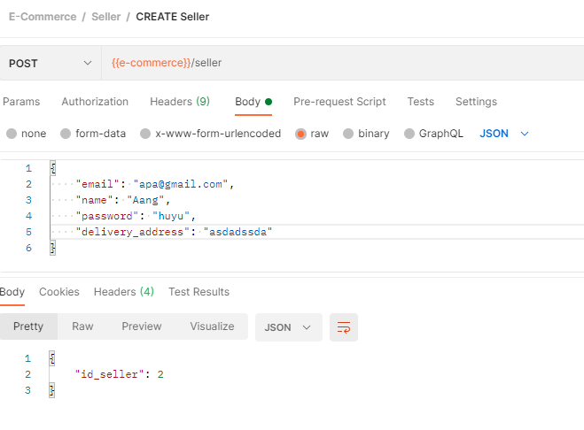   |
| 7 | Product | Get All Product | 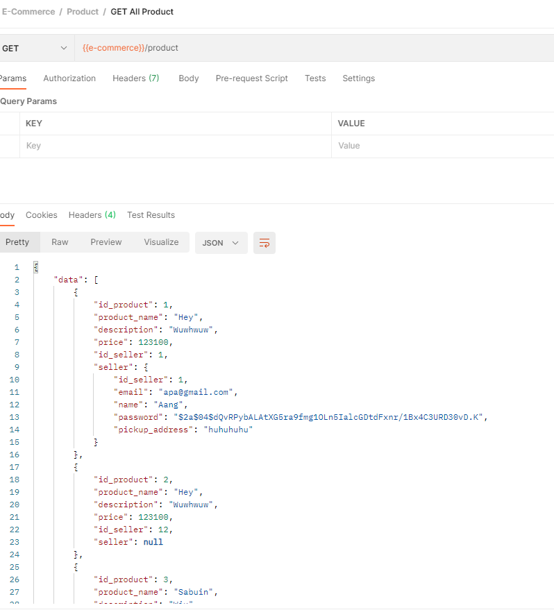   |
| 8 | Product | Get Product by ID | 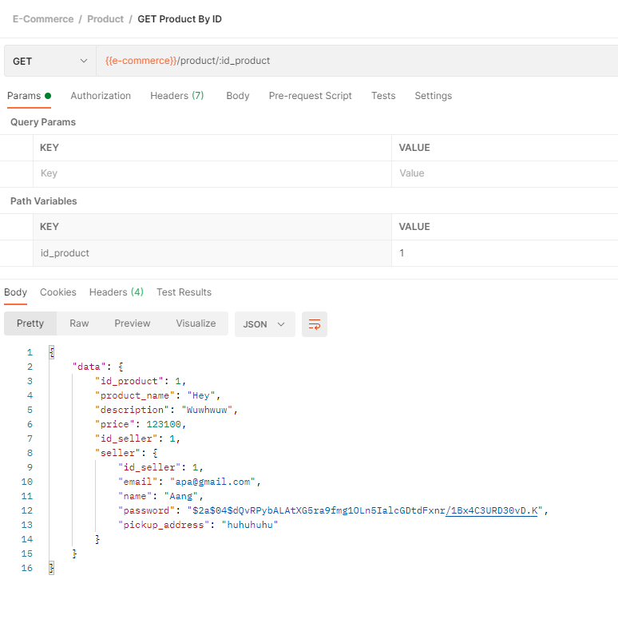   |
| 9 | Product | Get Product by seller ID | 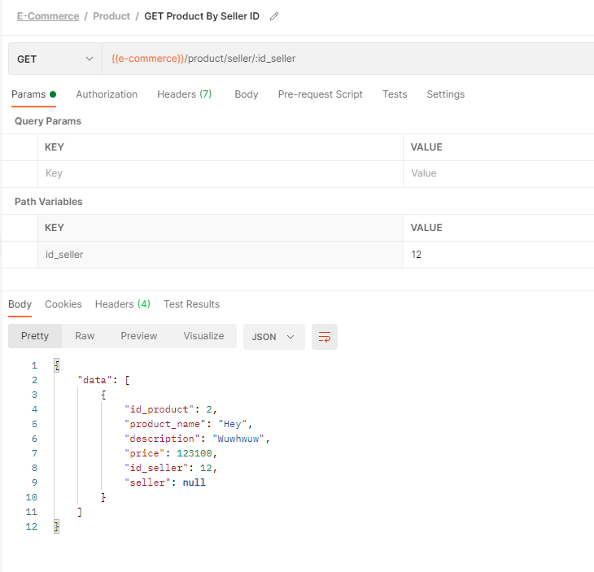   |
| 10 | Product | Create Product | 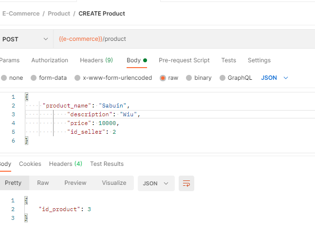   |
| 11 | Order | Get All Order | 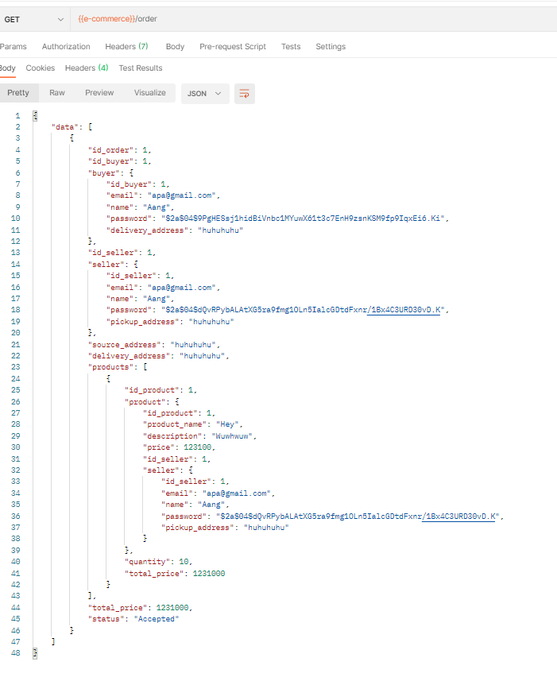   |
| 12 | Order | Get Order by ID | 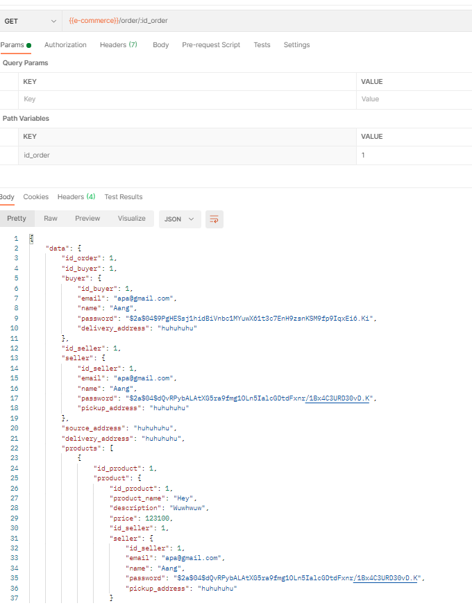   |
| 13 | Order | Order Order | 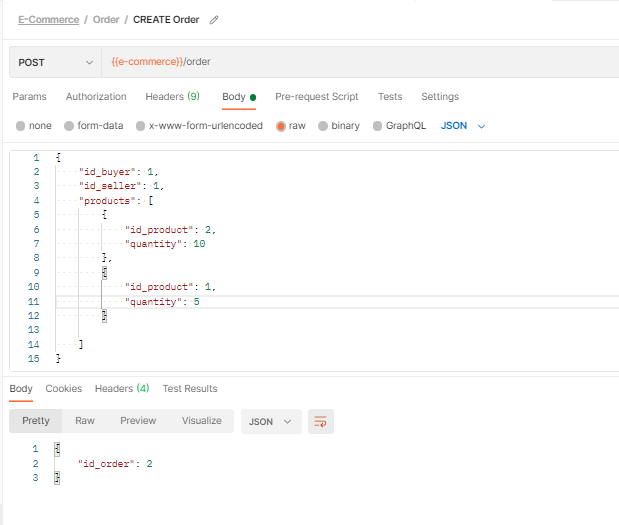   |
| 14 | Order | Accept Order | 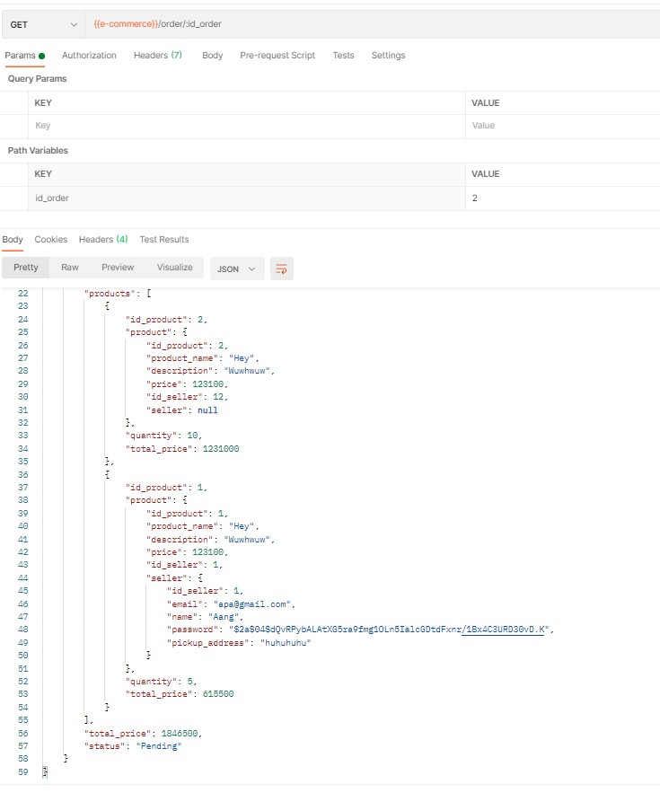   |
|  |  | Accept Order | 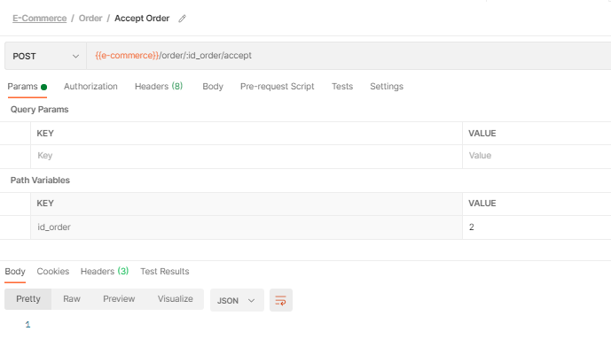   |
|  |  | Accept Order | 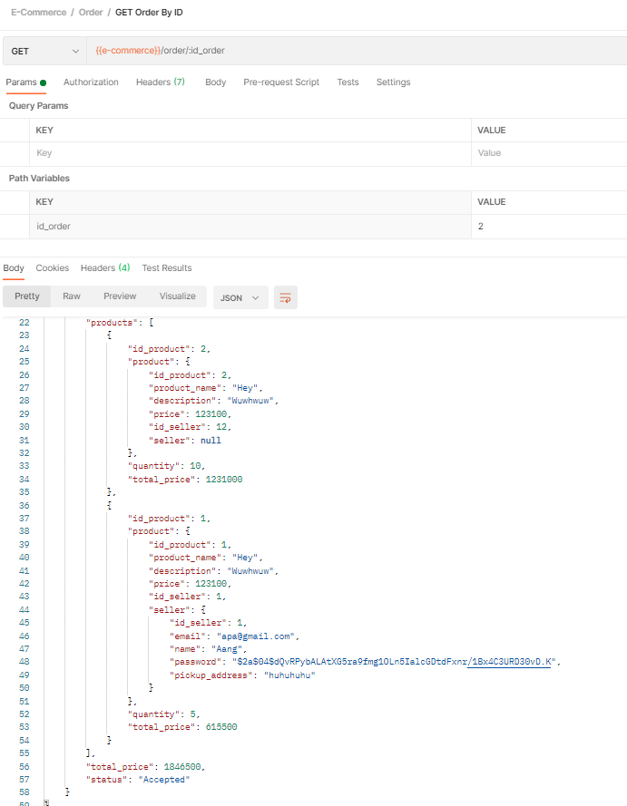   |